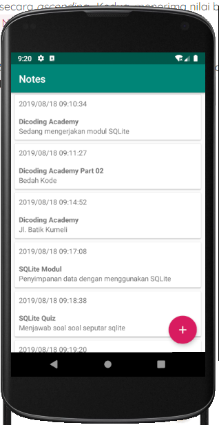
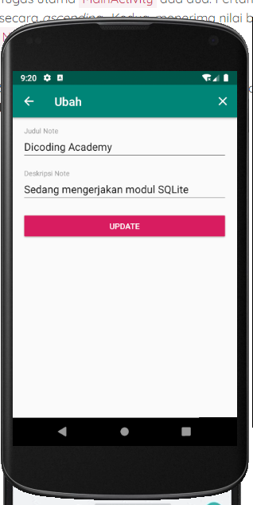
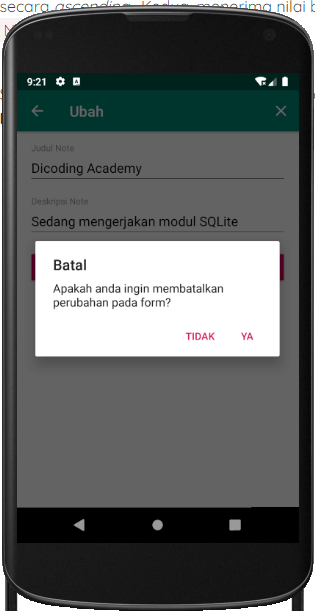
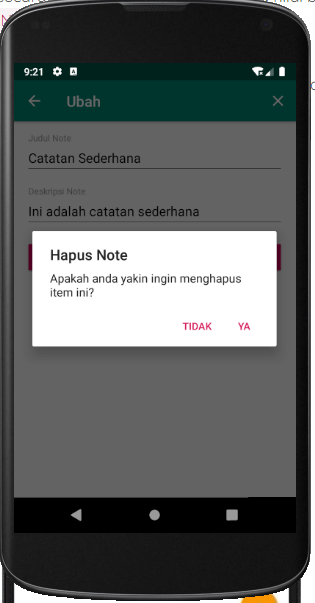

## My Note atau Catatan Ku App
### Implementasi SQLite Pada Aplikasi Android

Dokumentasi bisa di temukan dibawah ini:

[Dokumentasi asynctask](https://developer.android.com/reference/android/os/AsyncTask)
[Dokumentasi SQLite](https://developer.android.com/reference/android/database/sqlite/package-summary)

[Sumber dan Hak Cipta](https://www.dicoding.com/)

Screenshot aplikasi berikut ini :

